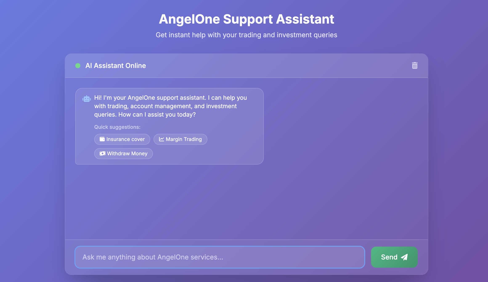
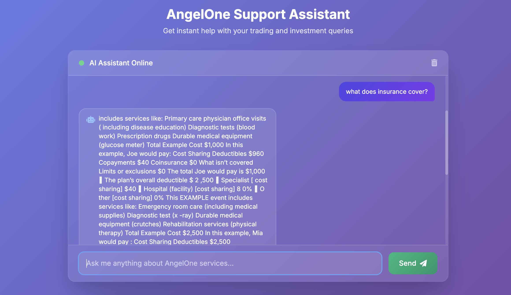
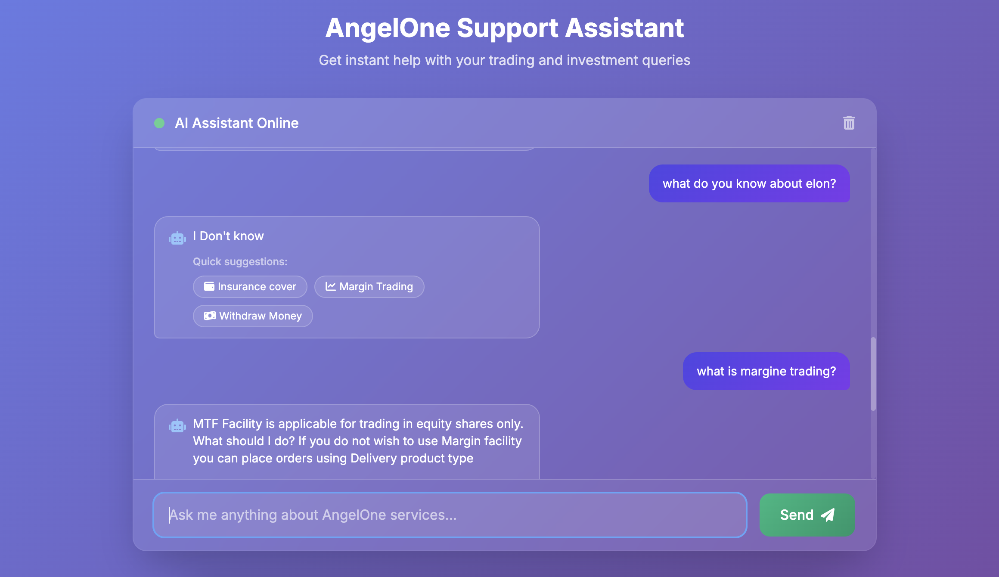

# AngelOne RAG Chatbot - Complete Documentation

## Table of Contents
1. [Project Overview](#project-overview)
2. [Development Journey](#development-journey)
3. [Architecture](#architecture)
4. [Setup Guide](#setup-guide)
5. [Data Collection Workflow](#data-collection-workflow)
6. [Vector Database Setup](#vector-database-setup)
7. [Running the Application](#running-the-application)
8. [API Documentation](#api-documentation)
9. [Deployment](#deployment)
10. [Technical Decisions](#technical-decisions)

---

## Project Overview

This project implements a **Retrieval-Augmented Generation (RAG) chatbot** specifically trained on AngelOne customer support documentation. The system answers user queries by retrieving relevant information from the knowledge base and generating contextual responses.

### Key Features
- **Domain-specific knowledge**: Trained exclusively on AngelOne support content
- **"I Don't Know" responses**: Refuses to answer questions outside the knowledge base
- **Free AI models**: Uses Hugging Face transformers instead of paid APIs
- **Persistent vector storage**: ChromaDB for efficient similarity search
- **Web interface**: Simple HTML chatbot interface

### Technology Stack
- **Backend**: FastAPI (Python)
- **Vector Database**: ChromaDB with SentenceTransformer embeddings
- **AI Models**: DistilBERT (Hugging Face)
- **Frontend**: HTML/CSS/JavaScript
- **Data Processing**: BeautifulSoup, PyPDF2
- **Deployment**: Netlify (frontend) + Local backend with ngrok

---

---

## Screenshots

### Working Chatbot Interface

*Clean, responsive chat interface*

### Valid AngelOne Query Response

*Example of the bot answering an AngelOne-specific question with source references*

### "I Don't Know" Response for Out-of-Scope Questions

*Bot correctly refusing to answer questions outside the AngelOne knowledge base*

---

## Development Journey

### Learning Phase
1. **RAG Understanding**: Researched RAG architecture and its advantages over standard LLMs
2. **Key Concepts Learned**:
    - **Transformers**: Neural network architecture for NLP tasks
    - **Vector Databases**: Storage systems for embedding-based similarity search
    - **Embeddings**: Vector representations of text for semantic similarity
3. **Resources Used**: IBM Technology YouTube videos, ChatGPT, Claude AI

### Implementation Challenges & Solutions

#### Challenge 1: Data Collection
**Problem**: Need to scrape AngelOne support pages and process PDF documents
**Solution**:
- Built `scraper.py` for content extraction
- Created `pdfScraper.py` for PDF text processing
- Combined data into `angelone_combined_data.json` for vectorization

#### Challenge 2: Vector Database Selection
**Problem**: Initial choices had issues
- **MongoDB**: Setup too complex and time-consuming
- **FAISS**: Compatibility issues with the environment
  **Solution**: Switched to **ChromaDB** - simpler setup and good performance

#### Challenge 3: Poor Response Quality
**Problem**: Initial implementation gave wrong answers for out-of-scope questions
**Solutions Applied**:
1. **Increased data quality**: Expanded maxPages in scraper for more comprehensive data
2. **Threshold tuning**: Set `min_similarity = 0.42` to filter irrelevant results
3. **Enhanced chunking**: Implemented overlapping text chunks (512 words, 50 overlap)

#### Challenge 4: Deployment Limitations
**Problem**: Backend hosting services (Render, Railway) either failed or were too expensive
**Solution**: Local backend with ngrok for public access, frontend on Netlify

---

## Architecture

```
┌─────────────────┐    ┌──────────────────┐    ┌─────────────────┐
│   Data Sources  │    │   Vector Store   │    │   AI Pipeline   │
│                 │    │                  │    │                 │
│ • AngelOne      │───▶│ • ChromaDB       │───▶│ • DistilBERT    │
│   Support Pages │    │ • Embeddings     │    │ • Q&A Pipeline  │
│ • Insurance     │    │ • Similarity     │    │ • Fallback      │
│   PDFs          │    │   Search         │    │   Generation    │
└─────────────────┘    └──────────────────┘    └─────────────────┘
         │                       │                       │
         ▼                       ▼                       ▼
┌─────────────────┐    ┌──────────────────┐    ┌─────────────────┐
│   Data Pipeline │    │   FastAPI Server │    │   Frontend UI   │
│                 │    │                  │    │                 │
│ • scraper.py    │    │ • /api/chat      │    │ • HTML/CSS/JS   │
│ • pdfScraper.py │    │ • /health        │    │ • Netlify       │
│ • vectorDB.py   │    │ • CORS enabled   │    │ • Chat Interface│
└─────────────────┘    └──────────────────┘    └─────────────────┘
```

---

## Setup Guide

### Prerequisites
- Python 3.8+
- Git
- ngrok (for backend public access)
- Netlify account (for frontend deployment)

### 1. Clone and Setup
```bash
# Clone the repository
git clone <your-repo-url>
cd rag-chatbot

# Create virtual environment
python -m venv venv
source venv/bin/activate  # On Windows: venv\Scripts\activate

# Install dependencies
cd backend
pip install -r requirements.txt
```

### 2. Directory Structure
```
rag-chatbot/
├── backend/
│   ├── main.py              # FastAPI server
│   ├── scraper.py           # Web scraping
│   ├── pdfScraper.py        # PDF processing
│   ├── vectorDB.py          # Vector database operations
│   ├── requirements.txt     # Python dependencies
│   ├── pdfs/               # PDF documents directory
│   ├── vector_db/          # ChromaDB storage
│   ├── angelone_support_data.json      # Scraped web data
│   ├── angelone_pdf_data.json          # Processed PDF data
│   └── angelone_combined_data.json     # Combined dataset
└── frontend/
    └── index.html          # Chat interface
```

---

## Data Collection Workflow

### Step 1: Web Scraping
```bash
cd backend
python scraper.py
```

**What it does:**
- Scrapes AngelOne support pages recursively
- Removes navigation/menu content intelligently
- Applies quality filters (min 100 words, 500 characters)
- Saves to `angelone_support_data.json`

### Step 2: PDF Processing
```bash
# Create pdfs directory and add PDF files
mkdir pdfs
# Add your insurance PDF files to this directory

# Run PDF scraper
python pdfScraper.py
```

**What it does:**
- Extracts text from all PDF files in `./pdfs` directory
- Cleans and normalizes text content
- Merges with web scraping data
- Creates `angelone_combined_data.json`

---

## Vector Database Setup

### Build the Vector Database
```bash
python vectorDB.py
```

**What happens:**
1. Loads `angelone_combined_data.json`
2. Splits documents into 512-word chunks with 50-word overlap
3. Generates embeddings using `all-MiniLM-L6-v2`
4. Stores in ChromaDB with persistence
5. Runs test queries to verify functionality

---

## Running the Application

### 1. Start the Backend Server
```bash
cd backend
python main.py
```

The server will start on `http://localhost:8000`

**Verify backend is working:**
```bash
# Health check
curl http://localhost:8000/health

# Test RAG system
curl http://localhost:8000/api/test

# Chat with the bot
Run index.html in a browser and use the chat interface
```

---

## API Documentation

### Base URL
- **Local**: `http://localhost:8000`
- **Public**: `https://your-ngrok-url.ngrok.io` if using ngrok

### Endpoints

#### `GET /`
**Root endpoint with API information**
```json
{
  "message": "AngelOne RAG Chatbot API (Free Version)",
  "status": "active",
  "models": "Hugging Face Transformers",
  "endpoints": {
    "chat": "/api/chat",
    "health": "/health",
    "docs": "/docs"
  }
}
```

#### `GET /health`
**Health check endpoint**
```json
{
  "status": "healthy",
  "vector_db_status": "ready",
  "total_chunks": 342,
  "model_status": "loaded"
}
```

#### `POST /api/chat`
**Main chat endpoint**

**Request:**
```json
{
  "message": "How do I add funds to my account?",
  "conversation_id": "optional-session-id"
}
```

**Response:**
```json
{
  "response": "To add funds to your AngelOne trading account, you can use multiple methods including UPI, net banking, and bank transfer...",
  "sources": [
    {
      "title": "AngelOne - Add Funds to Your Account",
      "url": "https://www.angelone.in/support/add-funds",
      "relevance_score": 0.785
    }
  ],
  "conversation_id": "optional-session-id"
}
```

#### `GET /api/test`
**Test the RAG system with predefined queries**

Returns test results for various question types to verify the system is working correctly.

---

## Frontend Integration

### HTML Structure
The frontend is a single-page application with:
- **Chat interface**: Message bubbles for user and bot
- **Source display**: Shows relevant documentation sources
- **Responsive design**: Works on desktop and mobile

### Key JavaScript Functions
```javascript
// Send message to backend
async function sendMessage(message) {
    const response = await fetch(`${API_BASE_URL}/api/chat`, {
        method: 'POST',
        headers: {
            'Content-Type': 'application/json',
        },
        body: JSON.stringify({ message: message })
    });
    return await response.json();
}
```

### Customization
To modify the frontend:
1. **Styling**: Update CSS in the `<style>` section
2. **API endpoint**: Change `API_BASE_URL` constant
3. **UI elements**: Modify HTML structure as needed

---

## Deployment

### Current Setup
- **Frontend**: Deployed on Netlify (static hosting)
- **Backend**: Running locally with ngrok for public access

---

## Technical Decisions

### Why These Technologies?

#### ChromaDB over Alternatives
- **vs MongoDB**: Simpler setup, built for embeddings
- **vs FAISS**: Better compatibility, persistence included
- **vs Pinecone**: Free, no external dependencies

#### Free Models over OpenAI
- **Cost**: No API fees
- **Privacy**: Data stays local
- **Control**: Can fine-tune and customize

#### FastAPI over Flask
- **Performance**: Async support
- **Documentation**: Auto-generated API docs
- **Type safety**: Pydantic models

### Model Selection
- **Embedding Model**: `all-MiniLM-L6-v2`
    - Good balance of speed vs accuracy
    - 384-dimensional embeddings
    - Works well for domain-specific content

- **Q&A Model**: `distilbert-base-uncased-distilled-squad`
    - Lightweight version of BERT
    - Pre-trained on SQuAD dataset
    - Fast inference on CPU

### Data Processing Decisions
- **Chunk size**: 512 words (optimal for model context length)
- **Overlap**: 50 words (preserves context across chunks)
- **Quality threshold**: 100+ words, 500+ characters
- **Similarity threshold**: 0.42 (balanced precision/recall)

---

## Conclusion

This project attempted to build a working RAG chatbot for AngelOne customer support. The final system can answer questions about AngelOne services and correctly responds with "I Don't know" for out-of-scope questions.

The development process involved learning about RAG systems, experimenting with different vector databases, and tuning parameters to improve response quality. With help from AI assistants (ChatGPT and Claude), a functional prototype was created using free tools and models.

### Final Results
- Successfully built a domain-specific chatbot
- Handles most of the valid AngelOne queries and rejects irrelevant questions
- Uses completely free tools (ChromaDB, Hugging Face models)
- Working deployment with frontend on Netlify and backend via ngrok

